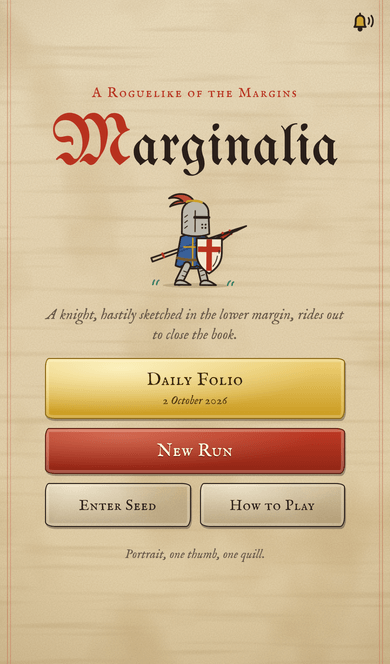
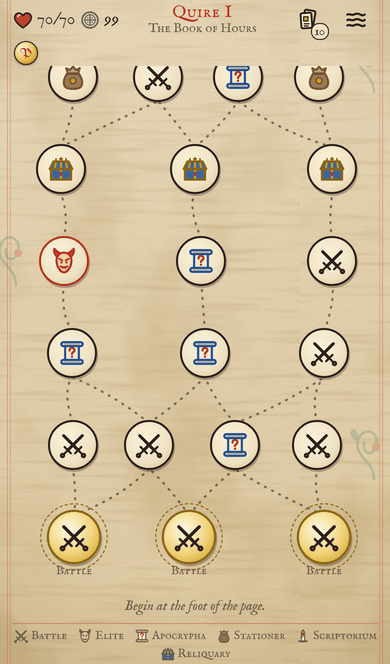
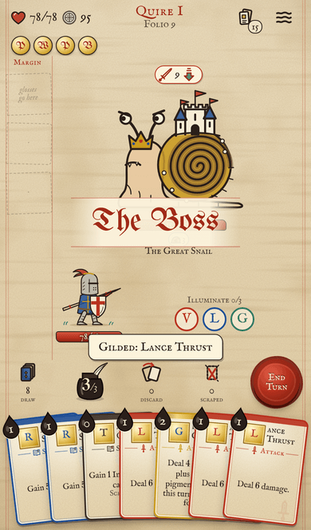

# Marginalia

*A roguelike deckbuilder in the margins of a Book of Hours.*

You are a knight sketched hastily in the lower margin of a 14th-century manuscript. The drolleries have
woken — snail-knights, killer rabbits, dog-headed men, the scribe's cat — and you must ride through three
Quires to the binding and close the book.

Built for iPhone Safari, one self-contained `index.html`, no server. Runs in about 15–20 minutes.

  

## How it plays
- **Ink** is your energy (3 per turn). **Ward** blocks damage until your next turn.
- Cards come in pigments: **Vermilion** (attack), **Lapis** (defence), **Verdigris** (Corrode & growth),
  **Gold** (wild), and **Ink** (utility).
- **Illuminate:** play a Vermilion, a Lapis and a Verdigris card in one turn (Gold counts as any) to gain
  +1 Ink and draw a card. Many cards have stronger *Illuminated:* effects.
- **Gloss** cards are written into your **Margin** (3 slots) and keep working all fight. Some foes erase them.
- **Blots** are junk cards foes smear into your deck. Scrape them away.
- Map nodes: battles, elites, **Apocrypha** (events), the **Stationer** (shop), the **Scriptorium** (rest:
  heal or gild a card), and **Reliquaries** (treasure).
- **Daily Folio:** everyone gets the same seeded run each day. Share any run with `?seed=XXXX`.
  Progress autosaves after every action.

## Content
74 cards, 36 relics, 15 events, 24 foes across three Quires (The Book of Hours, The Bestiary,
The Apocalypse) with three bosses: the Great Snail, the Scribe's Cat, and the Bookworm.

## Hosting on GitHub Pages
Push this repo, then **Settings → Pages → Deploy from a branch → `main` / root**. `index.html` at the
root is the whole game.

## Install on iPhone
Open the GitHub Pages URL in Safari → Share → **Add to Home Screen**. It launches full-screen like an app, with its own icon (`icon-180.png`, `manifest.webmanifest`).

## Development
Requires Node 18+. Source is in `src/`; `node build.js` bundles it into `index.html` (and `dist/index.html`).

| file | purpose |
|---|---|
| `src/engine.js` | rules engine: seeded RNG, combat, map, effect DSL, save state (no DOM) |
| `src/data/*.js` | cards, relics, events, enemies & encounters (data-driven) |
| `src/art_*.js` | hand-authored inline SVG art and icons |
| `src/ui.js`, `src/style.css` | mobile UI, animations, Web Audio SFX |
| `DESIGN.md` | full design contract and DSL reference |

Tests and tools:
```
node smoke.js 300                 # random-play crash test
node tools/validate_content.js    # card/relic/event schema checks
node tools/validate_enemies.js    # bestiary checks + damage table
node tools/stress_content.js      # exercises every card, relic, event and encounter
node tools/sim.js 400             # heuristic bot balance report (~2 min)
node tools/sim.js 300 --char nun --asc 5 --bosses   # per character / Rubrication; --bosses = paired boss bench
                                  # (--unlocked=none for a fresh player; default all achievements unlocked)
node tools/qa.js play             # Playwright tap-through on an iPhone viewport
```
